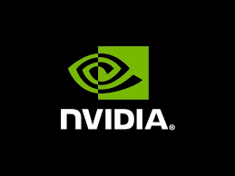

Historia i rozwój firmy NVIDIA
==============================

Firma **NVIDIA Corporation** została założona w 1993 roku przez trzech inżynierów: **Jensaena Huanga**, **Chrisa Malachowsky’ego** i **Curtisa Priema**. Jej siedziba główna mieści się w Santa Clara w stanie Kalifornia, w samym sercu Doliny Krzemowej. Od samego początku misją NVIDII było rozwijanie zaawansowanych technologii graficznych i obliczeniowych, które pozwalają komputerom „widzieć, myśleć i uczyć się”.

Pierwszym znaczącym sukcesem firmy był procesor graficzny **RIVA 128** z 1997 roku, który zapoczątkował erę akceleratorów 3D w grach komputerowych. Kolejne generacje, takie jak **GeForce 256** (1999), przyniosły rewolucję – był to pierwszy GPU zdolny do samodzielnego wykonywania obliczeń geometrycznych i oświetleniowych, wcześniej realizowanych przez CPU.

Przełomowe momenty w historii NVIDII:
-------------------------------------

* 2006 – wprowadzenie architektury **CUDA**, umożliwiającej wykonywanie obliczeń ogólnego przeznaczenia na GPU.  
* 2012 – start platformy **Tegra**, łączącej moc CPU i GPU w jednym układzie dla urządzeń mobilnych.  
* 2016 – prezentacja architektury **Pascal** i potężnych kart graficznych serii GTX 10xx.  
* 2020 – architektura **Ampere**, rewolucja w uczeniu maszynowym i grafice ray tracing.  
* 2022 – ogłoszenie serii **Hopper** i **Ada Lovelace**, ukierunkowanych na sztuczną inteligencję.

Dzięki strategii inwestowania w badania i rozwój, NVIDIA z małego startupu przekształciła się w jednego z kluczowych graczy na globalnym rynku technologii komputerowych i sztucznej inteligencji.

